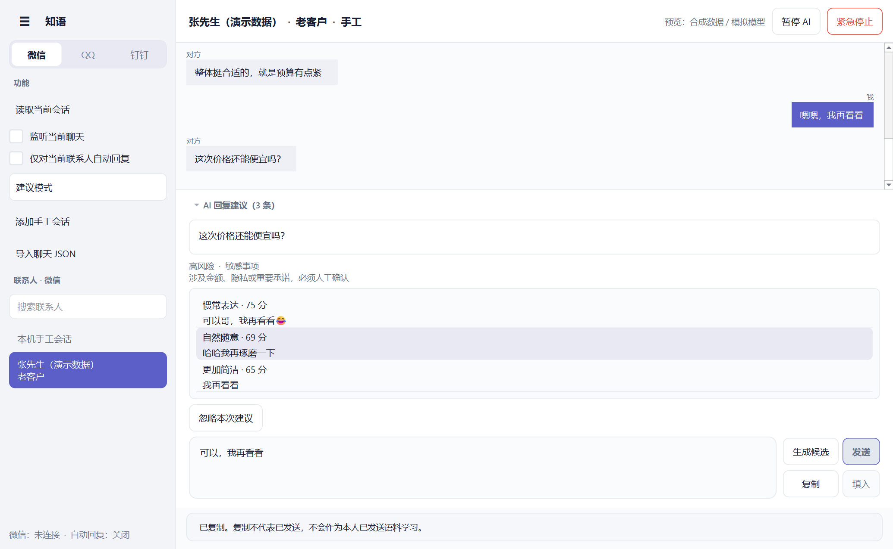
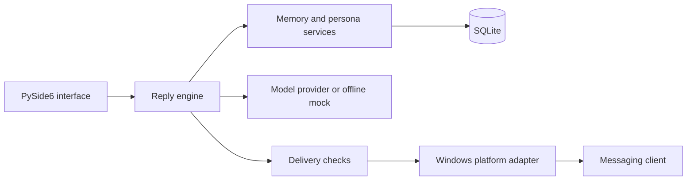

# Zhiyu — Context-Aware Conversation Assistant

A Windows desktop prototype exploring how language-model suggestions, contact-specific context and explicit delivery controls can support everyday messaging.

**Status:** portfolio prototype, with a Chinese-language interface. This is an application integration project, not a newly trained language model. Model quality and live client compatibility have not been established by a controlled study.

[中文说明](README.zh-CN.md) · [Architecture](docs/ARCHITECTURE.md) · [Evaluation](docs/EVALUATION.md) · [Attribution](THIRD_PARTY_NOTICES.md)



*Synthetic data and mock replies; this screenshot is not evidence of live client integration.*

## Problem and approach

Generic reply suggestions often overlook a person's conversational style and relationship with a contact. Zhiyu combines recent messages, keyword-retrieved history, explicitly recorded facts and statistical style features to produce three editable reply candidates. A separate delivery layer handles context checks, confirmation and uncertain results.

The project connects software engineering with human–AI interaction: a plausible suggestion should remain distinguishable from a verified fact or an executed action.

## What is implemented

- PySide6 desktop interface with conversation, persona, memory and settings views.
- SQLite storage with incremental migrations, conversation isolation and feedback records.
- A replaceable model-provider interface and structured three-candidate response validation.
- Transparent heuristic ranking based on length, keyword overlap, repetition and style cues.
- Delivery checks for changed context, duplicate operations, paused execution and uncertain outcomes.
- Windows adapters for WeChat, QQ and DingTalk, with explicit failure and review states.
- An opt-in, narrowly constrained automatic-reply path exists in the code. It is experimental; the portfolio demonstration uses manual conversations and does not exercise it.

## Run on Windows

Use Python 3.12 for the CI target; the base application also runs on the locally tested Python 3.14. Local validation details and remaining portability checks are recorded in [Evaluation](docs/EVALUATION.md).

```powershell
py -3.12 -m venv .venv
.\.venv\Scripts\python.exe -m pip install -r requirements.txt
.\.venv\Scripts\python.exe -X utf8 scripts/demo.py
```

The offline demonstration uses a temporary database and deterministic mock replies. It needs no API key or messaging account, sends nothing, and is not a demonstration of actual model quality.

Live WeChat and OCR backends are optional: `python -m pip install -r requirements-windows-integrations.txt`. They are excluded from the base demo and CI installation. Prefer Python 3.12 for these upstream dependencies; installation and live behaviour need separate verification. The legacy wxauto backend is not included.

To open the desktop interface:

```powershell
.\.venv\Scripts\python.exe -m app
```

Add a manual conversation or import `examples/synthetic-chat.json`. For actual model-generated replies, copy `.env.example` to `.env` and set your own API key. Selected messages, relationship information, persona features and memory are then transmitted to the configured model service. Local storage does not mean inference is entirely local.

## Verify

```powershell
.\.venv\Scripts\python.exe -m pip install -r requirements-dev.txt
.\.venv\Scripts\python.exe -m unittest discover -s tests -v
.\.venv\Scripts\python.exe -m app --smoke-test
.\.venv\Scripts\python.exe scripts/verify_ui.py
.\.venv\Scripts\python.exe scripts/check_release.py
```

The legacy wxauto desktop integration test is skipped unless `ZHIYU_LIVE_UIA_TEST=1` is explicitly set and that optional backend is installed. It is separate from automated regression tests. A Windows GitHub Actions workflow is included; its hosted execution must be checked after upload.

## Architecture



## Boundaries

WeChat uses a third-party backend. QQ can expose ambiguous contact identity. DingTalk may not expose readable message content through accessibility APIs. OCR-derived text is untrusted until reviewed. The repository does not promise universal client support or prove that a recipient received/read a message.

Memory summaries are excerpts, not learned semantic summaries. Persona statistics and risk rules are baselines, not evidence of factual accuracy or robust safety. No fine-tuning, embedding index, benchmark accuracy, user-study improvement or production-scale claim is made.

## Development and attribution

This project was developed with AI-assisted coding. Repository structure separates application orchestration from external packages; Windows accessibility, the model service and WeChat internals are not original algorithms. See [third-party notes](THIRD_PARTY_NOTICES.md) and [contribution disclosure](docs/CONTRIBUTIONS.md). Applicants should describe only contributions they can explain and substantiate.

No blanket open-source licence is assigned in this preparation pass. Source is presented for review; dependency licences remain applicable. Review ownership and select a licence before inviting reuse.
